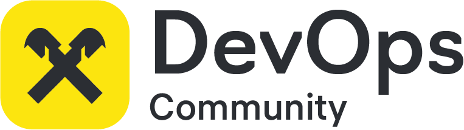

<div align="center">
  <center><h1>The way of CI/CD project</h1></center>
  <center></center>
</div>

## About the Project

The Way of CI/CD is a project from which you can assemble your custom pipeline by using different pieces of code or by including entire stages. This project serves as a builder for creating pipelines in GitLab.

The Way of CI/CD includes the following pipeline stages:

- [code-scan](./code-scan/)
- [version](./version/)
- [build](./build/)
- [binary-scan](./binary-scan/)
- [test](./test/)
- [release](./release/)
- [deploy](./deploy/)

You can find usage instructions for specific pipeline stages in the directories above.

## Pipeline Usage

You can borrow or reuse pipeline components using three GitLab CI/CD directives: `include`, `extends`, and `!reference [tags]`.

`include`:

```yaml
include:
  - project: 'path-to-gitlab-repo/the-way-of-cicd-open-source-edition'
    ref: 'master'
    file:
      - '/build/v3/build.yml'
```

`extends`:

```yaml
build-via-kaniko:
  stage: build
  extends:
    - .build_kaniko
```

`!reference [tags]`:

```yaml
build-via-kaniko:
  stage: build
  image:
    name: !reference [.build_kaniko, image, name]
    entrypoint: !reference [.build_kaniko, image, entrypoint]
  before_script:
    - !reference [.build_kaniko, before_script]
  script:
    - !reference [.build_kaniko, script]
```

For more details on all directives and implementation details, you can refer to the official [GitLab documentation](https://docs.gitlab.com/ee/ci/yaml/yaml_optimization.html).

## Pipeline Design

<p align="center">
  
</p>

## Recommended Requirements for Implementing Your Pipeline

### Compiled Report (.pre-test)

- Tests must exist.
- Testing should be performed for every commit in any branch.
- The test results should include a `coverage` report for the Sonar task and, if possible, a `junit` report for viewing in the interface.
- When using `testcontainers` on shared Kubernetes runners, Ryu is not mandatory.
- All images should be pulled from the Registry.
- It's recommended to avoid creating a separate dependent container (e.g., a database) for each individual test.

### Code Scan

- Static analysis should use SonarQube and helm lint.
- Use a consistent project key pattern in the pipeline.
- It's recommended to specify additional parameters for checking pull requests and branches.
- For open repositories, it's recommended to set up [badges](https://docs.gitlab.com/ee/user/project/badges.html) in GitLab to display project check results.
- Sonar properties can be used, but if the team desires, you can use our stage and add your own parameterization.
- Scanning conditions:
  - Scanning is performed for each commit.
  - Scanning is performed for detached pipelines in merge requests.
  - Scanning is not performed for tags and the `master/main/trunk` branch.

### Version

- The application version should be readable and understandable.
- It should be easy to trace the application version.
- The application version should be read from `LABEL` or `Actuator Info (Spring)`, etc.
- It's recommended to have the ability to recreate `n` number of application versions.
- For versioning, it's recommended to use semantic versioning with a major, minor, and patch version counter - [semver.org](https://semver.org/).
- It's recommended to store the major version of the application as a file in the repository (`majorVersion`).
- SemVer is formed exclusively for `master/main/trunk` branches; in other cases, GitLab environment variables `$CI_COMMIT_REF_SLUG-$CI_COMMIT_SHORT_SHA` are used.
- [gitversion.net](https://gitversion.net/) is used as the primary versioning tool.

### Build

- All passwords used during the build process must be obtained from `vault`.
- Storing sensitive information openly in the repository, such as in `.npmrc` or `build.gradle`, is not recommended.
- Personal accounts should not be used in CI; only service accounts should be used.
- The result of the build is an artifact in the registry and data in CI, which can be used in subsequent stages to obtain the published artifact.
- The logic for initiating the build and running tests is determined by the team.
- It is recommended to perform the build using native tools if available.
- The artifact should be easily traceable to a specific pipeline or commit.
- Artifact build should only be done once for all stages.
- Deploying a service to a specific environment should not require a separate build.
- Environment variables and other parameters should be passed to different environments in a way that avoids the need for artifact rebuilding.
- Complexity in artifact formation logic should be minimized.
- It is not recommended to perform a complete build of the base image directly in the service pipeline; instead, it should be treated as a base image and pulled from the registry.
- Avoid using `latest` tags in the versioning of external service dependencies.

### Binary Scan

- Image scanning should have a mechanism for blocking or skipping further pipeline execution based on conditions determined by the team.
- After scanning images, we should be able to examine vulnerabilities in the scanned image.

### Test

- Team Responsibility

### Release

- It is recommended to use `./release-cli` to create [releases](https://docs.gitlab.com/ee/user/project/releases/) in GitLab in conjunction with the [versioning](#version) stage.
- Using `./release-cli` in GitLab also allows for creating `git tags` and tracking application versions, creating immutable reference objects.

### Deploy

- Kubernetes is recommended as the target deployment platform for services.
- For applications, a Helm chart is provided:
  - All `mutable` data is placed in variables.
  - Sensitive data is placed in `kind: Secret`.
  - Variable values are passed through environment variables, or you can do this through `kind: Configmap`.
- The deployment repository contains `values` for different stages, or there is a job capable of fetching data from external repositories.
- Credentials should not be stored openly and should be substituted during template rendering either from variables defined in `CI/CD Settings`, but the preferable approach is to use `HashiCorp Vault`.
- Deployment logic can be either within the service repository or separated into a separate repository and triggered from the application code repository.

### Verify Deploy

- In development progress

### Auto Roll-Back

- Helm is the primary implementation for automatic rollback.
- In this project, the rollback stage allows you to revert to the previous version of the application, essentially the previous one.

## How to Contribute

You can participate in the project in the following ways:

- Share your work that can be reused by making a Merge Request.
- Report issues with the existing template or suggest improvements.

## Contribution Rules - Agreement

When developing and improving the project, we follow these rules:

- If you want to change existing functionality in one of the pipeline sections, you should copy the existing structure, creating a new directory from the current one, e.g., from `/build/v3/`, you create `/build/v4/`, and place everything from the previous version there while adding new functionality. This helps protect users of the product from unexpected changes and guarantees stability.
- If you find any issues or bugs, you can make fixes in the existing pipeline version.
- Pay attention to documentation. We provide examples in each directory corresponding to the pipeline step, describing how to use the pipeline's functionality.
- Parameterization: All values that can be customized should be. Teams should have flexibility in usage, so create variables and use them as parameters.

## About Development

This project is developed by the DevOps community.
We are an open-source community within the corporation, so all inner-source contributions and improvement suggestions are welcome.
To suggest improvements, you can create issues in the project or create merge requests independently.


