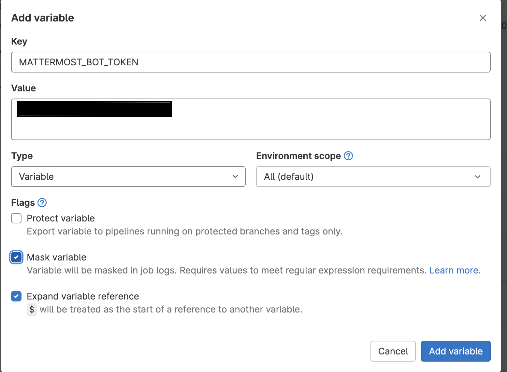

# Pipeline constructor for JAVA testing stages

## Description

This section contains the pipeline constructor for the application testing stages.

## GitLab environment variables used in the pipeline
### Variables that do not require redefinition

Variables starting with **CI** cannot be **overridden**
```yaml
CI_PROJECT_NAME - Predefined variable, stores the name of the pipeline's project.
CI_COMMIT_BRANCH - Predefined variable, stores the name of the branch being used in the pipeline.
CI_PAGES_URL - Predefined variable, stores a link to the GitLab Pages page.
CI_JOB_ID - Predefined variable, stores the job's ID.
```
### Variables Set in Project Settings
These variables should be set in the project settings in GitLab and marked as "Masked."
```yaml
REGISTRY_USER - The login of the service account for accessing the registry.
REGISTRY_PASSWORD - The password of the service account for accessing the registry.
GRADLE_PARAMS - Gradle parameters containing special settings. Example: -Dgradle.wrapperUser=$REGISTRY_USER -Dgradle.wrapperPassword=$REGISTRY_PASSWORD -Pregistry_user=$REGISTRY_USER -Pregistry_password=$REGISTRY_PASSWORD
MATTERMOST_BOT_TOKEN - Mattermost bot token used for sending messages to a Mattermost channel.
MATTERMOST_CHAT_ID - Mattermost chat ID created for displaying notifications about test runs.
```
### Optional Variables (Not Mandatory to Set)
```yaml
GRADLE - Gradle command
MAVEN - Maven command
PIPELINE_CACHE_KEY
BUILD_JOB_IMAGE - Registry path to the image used by jobs
MAVEN_SETTINGS - Predefined variable, stores the setting.xml configuration for Maven
MAVEN_OUT_DIR - Predefined variable, stores the path to the Maven compilation results directory
GRADLE_OUT_DIR - Predefined variable, stores the path to the Gradle compilation results directory
MAVEN_ALLURE_RESULTS_DIR - Predefined variable, stores the path to the directory with the results of tests executed using Maven
GRADLE_ALLURE_RESULTS_DIR - Predefined variable, stores the path to the directory with the results of tests executed using Gradle
MAVEN_ALLURE_REPORT_DIR - Predefined variable, stores the path to the directory with the report of completed testing using Maven. It is recommended not to change this variable, as the allure_notification utility is programmed to extract reports from the path /target/site/allure-maven-plugin/
GRADLE_ALLURE_REPORT_DIR - Predefined variable, stores the path to the directory with the report of completed testing using Gradle
KAFKA_CACHE_DIR - The path to the files with kafka secrets copied to the cache
```
### Variables Set in gitlab-ci.yaml
```yaml
SERVICE_NAME - Desired service name
PIPELINE_REPO - URL of the repository with the shared pipeline constructor
PIPELINE_BRANCH - Branch name in the pipeline constructor repository
BUILD_TYPE - Java project build type, supporting Maven and Gradle
USE_REPO_WRAPPER - Use service or pipeline wrapper? "true" - use service wrapper
AUTOTEST_GRADLE_OPTS - Additional parameters for debugging auto tests, e.g., --stacktrace --info
MAVEN_CLI_OPTS - Additional parameters for debugging auto tests during Maven build
TEST_PARAMS - Test parameters, running by tags, methods, classes
ENABLE_TLS_V1_3 - an optional variable, required to install TLS1.3 certificates, can take the value "true"
BUILD_SEPARATELY - the parameter responsible for dividing the build and launch phases into separate steps. By default, "false"
```
### Variables Used in Mattermost Report Sending
```yaml
ENVIRONMENT_NOTIF - The environment whose name is displayed in the report
MATTERMOST_BOT_TOKEN - Mattermost bot token used for sending messages to a Mattermost channel
MATTERMOST_CHAT_ID - Chat ID in Mattermost created for displaying notifications about completed test runs
```

## Job Descriptions

* **get_maven_wrapper/get_gradle_wrapper** - These tasks download the necessary wrapper from the pipeline repository if needed.
* **test_env_prepare** - This task prepares the environment inside the pod, including downloading wrappers if necessary and copying allure-notifications.jar, which is required for sending test run information to Mattermost.
* **extract_kafka_cache** - The task copies the files needed to connect to Kafka from KAFKA_CACHE_DIR to the root of the project
* **load_vault** - The task loads the data downloaded from the vault into the sensitive system variables
* **enableTLSv1_3** - The task activates TLS1.3 certificates, it works if you set the ENABLE_TLS_V1_3 variable to "true"
* **build_tests** - Build the project without running tests. Build artifacts are stored in:
  * Maven - target/
  * Gradle - build/
* **run_autotests_java** - Run tests based on the build created by the build_tests task with the skipAssemble parameter defined in the project. View the results of the tests in:
  * Maven - target/allure-results
  * Gradle - build/allure-results
* **create_autotests_report** - This task generates an Allure report from the results of tests executed by the run_autotests task. View the generated report in:
  * Maven - target/allure-report
  * Gradle - build/reports/allure-report/allureReport
* **pages** - Publish the report generated by the create_autotests_report task to GitLab Pages.
* **send_report_to_mattermost** - This task sends the report generated by the create_autotests_report task to a Mattermost channel using the Mattermost bot.

### Brief Instructions for Setting Up Mattermost Notifications
1. Create a channel in Mattermost.
2. Create a bot. The process is described in detail in [this article](https://github.com/qa-guru/allure-notifications/wiki/Mattermost-configuration#12-create-bot-account).
3. [Register the bot](https://developers.mattermost.com/integrate/webhooks/incoming/).
4. Add the bot to the previously created Mattermost channel.
5. In the GitLab project with tests, add the MATTERMOST_CHAT_ID and MATTERMOST_BOT_TOKEN variables (the token is displayed in Bot Father after registering the bot). Be sure to mark these variables as **Masked**.



## Project Configuration
### Gradle
Define the "skipAssemble" parameter in the project:
```java
if (project.hasProperty("skipAssemble")) {
    if (gradle.getTaskGraph().hasTask("compileKotlin")) {
        gradle.startParameter.excludedTaskNames += "compileKotlin"
    }
    gradle.startParameter.excludedTaskNames += "compileJava"
    gradle.startParameter.excludedTaskNames += "processResources"
    gradle.startParameter.excludedTaskNames += "classes"
    if (gradle.getTaskGraph().hasTask("compileTestKotlin")) {
        gradle.startParameter.excludedTaskNames += "compileTestKotlin"
    }
    gradle.startParameter.excludedTaskNames += "compileTestJava"
    gradle.startParameter.excludedTaskNames += "processTestResources"
    gradle.startParameter.excludedTaskNames += "testClasses"
}
```

## Using Templates

The project includes several templates ready for use:
* **full-autotest-template.yml** - A complete testing cycle, including environment preparation, testing, report generation, publishing the report to GitLab Pages, and sending it to Mattermost.
* **small-autotest-template.yml** - Testing and publishing reports to gitlab-pages

#### Regardless of how you use the pipeline modules tasks, you need to define the variables independently.
```yaml
########################################
###      Define pipe variables       ###
########################################
variables:
  SERVICE_NAME: "your-service"
  PIPELINE_REPO: "path-to-gitlab-repo/the-way-of-cicd-open-source-edition.git"
  PIPELINE_BRANCH: "4.0"
  BUILD_TYPE: "gradle"
  USE_REPO_WRAPPER: "true"
  AUTOTEST_GRADLE_OPTS: "-Pspring.profiles.active=test"
  ENVIRONMENT_NOTIF: "your environment"
```

### Examples of Including a Ready-Made Template in .gitlab-ci.yml

```yaml
########################################
### Include template jobs and stages ###
########################################
include:
  - project: 'path-to-gitlab-repo/the-way-of-cicd-open-source-edition'
    ref: 'Major.minor.patch' # Please fill in with the desired tag
    file:
      - 'test/full-autotest-template.yml'

```
## Example of Creating Your Own Pipeline in .gitlab-ci.yml

```yaml

########################################
###      Definee pipe stages         ###
########################################
stages:
  - prepare
  - build
  - test
  - test_report
  - deploy-pages

########################################
###      Include jobs                ###
########################################
include:
  - project: 'path-to-gitlab-repo/the-way-of-cicd-open-source-edition'
    ref: 'Major.minor.patch' # Please fill in with the desired tag
    file:
      - 'test/autotests/autotest.yml'

########################################
###   Create job in your pipeline    ###
###     extending included job       ###
########################################
test_env_prepare:
  stage: prepare
  extends:
    - .test_env_prepare
  variables:
    USE_REPO_WRAPPER: true"

```

## Using Vault
В вашем `.gitlab-ci.yml`:
```yaml
########################################
###      Definee stage for           ###
###      load vault secrets          ###
########################################
stages:
  - prepare

########################################
###      Include template job        ###
########################################
include:
  - project: 'path-to-gitlab-repo/the-way-of-cicd-open-source-edition'
    ref: 'Major.minor.patch' # Please fill in with the desired tag
    file:
      - 'pipeline/pipeline.yml'

######################################
###      Получение секретов        ###
###      внутри GitLab job         ###
######################################
use_vault:
  stage: prepare
  variables:
    VAULT_ADDR: "https://your.vault.path.com"
    VAULT_PATH_TO_SECRET: "kv/your_project"
    LOGIN_FIELD: "login"
    PASSWORD_FIELD: "password"
  extends:
    - .get_vault_creds
  script:
    - source vault.env
    - echo "DB_LOGIN=$LOGIN" > vault.env
    - echo "DB_PASSWORD=$PASSWORD" >> vault.env
  cache:
    - key: $CI_PIPELINE_ID
      paths:
        - vault.env
```
After obtaining secrets in the `.run_autotests_java` task, a script is called to load the created Vault secrets. 
In the `.run_autotests_java` task, Vault secrets are present as regular system variables. 
Access to these variables can be done, for example, through .yaml or .properties files or a custom PropertyReader.
